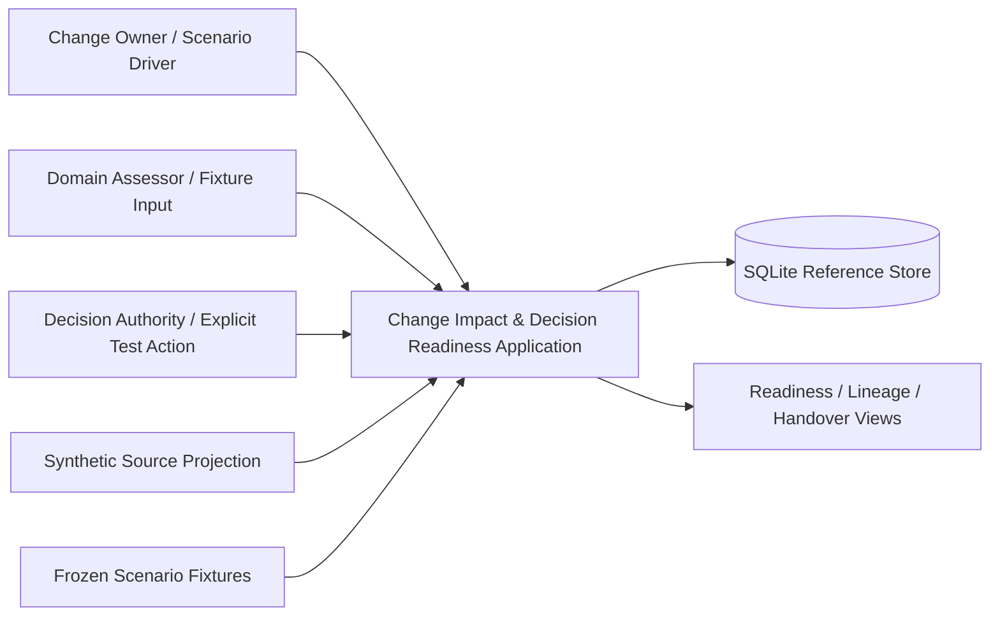
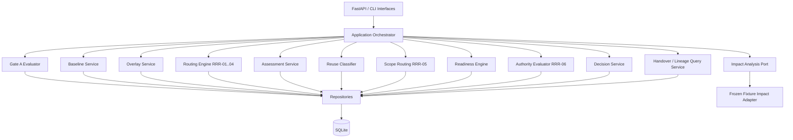

# Product Change Impact Assessment & Decision Readiness

## Solution Architecture v0.1 — Frozen Implementation Baseline

**Document type:** Solution Architecture  
**Status:** Frozen implementation baseline  
**Domain:** Synthetic automotive Product Lifecycle Management  
**Version:** 0.1  
**Date:** 25 August 2026  

**Governing frozen artefacts:**
- Business Architecture Definition v0.3.1 — Frozen Implementation Baseline
- Logical Information Model v0.3.2 — Frozen Implementation Baseline
- Scenario Data Definition v0.1 — Frozen Implementation Baseline
- Readiness and Routing Rules v0.1 — Frozen Implementation Baseline (`RRR-v0.1`)

---

## Document Notice

This document defines the software solution architecture for the bounded **Product Change Impact Assessment & Decision Readiness** demonstrator.

It translates the frozen business, information, scenario, and rule semantics into concrete implementation structure.

It does **not** redefine the frozen PLM semantics and does not introduce:

- a production PLM platform;
- enterprise source-authority rules;
- enterprise source-freshness rules;
- a general workflow engine;
- a general configuration engine;
- a general impact-discovery engine for arbitrary PLM graphs;
- automated engineering approval;
- an approval hierarchy beyond `Standard < Elevated`;
- additional Change Item actions;
- production, plant, stock, service, or release semantics;
- AI as a runtime dependency.

The prototype remains a **synthetic integration projection and deterministic demonstrator**.

The implementation principle is:

> **Software structure may change; frozen business meaning may not.**

### Freeze record

The blocker-only review identified and this frozen version incorporates exactly two implementation corrections:

1. a later target-execution Assessment Obligation may reference a locked historical Assessment through a valid `Retained` reuse classification without mutating the historical Assessment;
2. a Product Version becomes immutable in the demonstrator when it is first captured as a Product Version Baseline Member, enforced by both application guards and SQLite triggers.

No other solution semantics are changed.

---

# 1. Purpose

The purpose of Solution Architecture v0.1 is to define, precisely enough for an implementation plan:

1. architecture style;
2. technology stack;
3. module boundaries;
4. persistence approach;
5. mapping from the Logical Information Model to physical storage;
6. rule execution structure;
7. baseline and overlay processing;
8. impact-analysis integration for the bounded prototype;
9. Assessment and Evidence handling;
10. readiness and authority evaluation;
11. explicit terminal-decision handling;
12. process-history persistence;
13. derived Handover View generation;
14. prototype interfaces;
15. transaction and immutability controls;
16. deterministic Scenario A–C verification architecture.

This document does not contain the implementation task breakdown. That belongs to **Prototype Implementation Plan v0.1**.

---

# 2. Architecture Authority

The precedence order remains:

```text
Business Architecture v0.3.1
        ↓
Logical Information Model v0.3.2
        ↓
Scenario Data Definition v0.1
        ↓
Readiness and Routing Rules v0.1
        ↓
Solution Architecture v0.1
        ↓
Prototype Implementation Plan
        ↓
Code and tests
```

A software convenience must never override a higher-level frozen rule.

If implementation exposes an actual contradiction that prevents Scenarios A–C from being represented or executed deterministically, the contradiction must be raised explicitly rather than hidden in code.

---

# 3. Architecture Objectives

The solution is optimized for the following qualities, in priority order.

## SA-QA-01 — Determinism

The same frozen scenario state under `RRR-v0.1` must always produce the same:

- eligibility result;
- Impact-analysis lineage;
- Assessment Obligations;
- reuse classifications;
- Gate B result;
- Authorisation Eligibility result;
- required authority;
- routing outcome;
- terminal Decision persistence result;
- final scenario state.

No random, probabilistic, semantic-AI, or time-dependent rule evaluation is permitted.

## SA-QA-02 — Traceability

Every persisted result must remain traceable to the exact:

- Change Case;
- Change Item revision;
- Assessment Baseline;
- Overlay Revision;
- Impact-analysis Execution;
- Impact Candidate provenance;
- Assessment;
- Evidence state;
- rule-set version;
- Decision Scope where applicable.

## SA-QA-03 — Historical reconstruction

Later mutable source state must not alter historical analysis or decision meaning.

The implementation must reconstruct a historical Decision from immutable snapshots and locked supporting records only.

## SA-QA-04 — Semantic separation

The software must preserve the frozen distinctions between:

- source current state and Assessment Baseline;
- baseline and overlay;
- Change Item identity and Change Item revision;
- proposal state and terminal disposition;
- Impact Candidate and authorised scope;
- Evidence and Requirement Conclusion;
- Gate B and Authorisation Eligibility;
- routing event and terminal Decision Record;
- Open Item and Decision Condition.

## SA-QA-05 — Inspectability

The reference implementation must be easy to inspect in a public repository.

Critical rule logic should therefore be explicit code with direct tests, not hidden inside a generic rules product, workflow engine, or low-code runtime.

## SA-QA-06 — Minimal operational complexity

The demonstrator should run locally with one command and no external infrastructure service.

---

# 4. Architecture Style

## 4.1 Selected style: modular monolith

The prototype shall be implemented as a **modular monolith** with clear internal boundaries.

Reasons:

- all frozen scenarios are bounded and case-local;
- no distributed scalability requirement exists;
- synchronous deterministic transactions are desirable;
- cross-module referential integrity is important;
- the portfolio value is in semantics and traceability, not infrastructure complexity.

Microservices would add deployment and transaction complexity without proving additional architectural value for this reference case.

## 4.2 Internal layering

The application is divided into four logical layers:

```text
Interfaces
    ↓
Application Services / Use Cases
    ↓
Domain + RRR-v0.1 Rule Functions
    ↓
Repositories / SQLite Persistence
```

External fixture and impact-result adapters enter through explicit ports.

## 4.3 No generic workflow engine

Process order is coordinated by application services.

There is no generic workflow-state machine engine.

The frozen process sequence is represented by explicit commands, validations, and persisted domain states.

---

# 5. Selected Technology Stack

The v0.1 reference implementation shall use:

| Concern | Selection | Reason |
|---|---|---|
| Runtime | Python 3.12+ | Small, readable, strong testing ecosystem, suitable for deterministic rule implementation |
| HTTP interface | FastAPI | Thin typed API boundary and automatic local documentation |
| Validation / DTOs | Pydantic v2 | Strict input and structured-payload validation |
| Persistence access | SQLAlchemy 2.x | Explicit relational mapping and transaction control |
| Database | SQLite 3 | Single-file reproducibility; sufficient for bounded demonstrator |
| Schema migration | Alembic | Versioned physical schema |
| Testing | pytest | Unit, integration, and deterministic oracle tests |
| CLI | Typer or small argparse wrapper | Scenario runner and local verification interface |
| Serialization | JSON / YAML fixture files | Human-readable frozen scenario data and evidence output |

No message broker, cache, search engine, graph database, container orchestrator, or external rules engine is required.

## 5.1 Why SQLite

SQLite is selected because the demonstrator requires:

- ACID transactions;
- foreign keys;
- uniqueness constraints;
- check constraints;
- immutable snapshot storage;
- local reproducibility;
- no multi-node concurrency.

The database is an implementation store for the synthetic projection, not an enterprise PLM database.

`PRAGMA foreign_keys = ON` is mandatory.

## 5.2 Portability boundary

SQLAlchemy keeps the physical mapping reasonably portable, but PostgreSQL migration is **not** an objective of v0.1.

No design choice should be justified by hypothetical enterprise scale.

---

# 6. System Context



The named human roles represent interaction boundaries only. No enterprise identity, access-control, or organisational model is inferred.

---

# 7. High-Level Component Architecture



The components above are software modules, not new PLM business objects.

---

# 8. Module Responsibilities

## 8.1 `source_projection`

Purpose:

- store and query the synthetic current-state projection;
- resolve Product Elements, Product Versions, Product Structure Occurrences, Requirements, Evidence Records, Configuration Contexts, Applicability Rules, and Effectivity values used by the fixture.

It is explicitly **not** the authoritative enterprise system of record.

Historical rules must not read this module when the frozen Baseline Member snapshot already supplies the required state.

## 8.2 `change_case`

Responsibilities:

- create/read Change Case;
- persist Change Item identity and immutable revisions;
- maintain Change Item Proposal State;
- enforce same-case revision lineage;
- support explicit scope amendment after `Scope Revision Required`;
- derive active Proposed Change Scope.

It does not infer or create Change Items from Impact Candidates.

## 8.3 `gate_a`

Responsibilities:

- execute the frozen Gate A predicates;
- resolve current source targets;
- validate `Revise Product State` target identity;
- validate `Change Applicability` target identity and supplied predecessor applicability reference;
- verify rationale, Configuration Context presence/completeness, and Initial Distribution Open Items.

The module has **no Baseline Member repository dependency**.

This dependency restriction is architectural and testable.

## 8.4 `baseline`

Responsibilities:

- establish a case-local immutable Assessment Baseline;
- materialise Baseline Member snapshots;
- perform the five-input baseline reuse decision when a later proposal cycle is created;
- prevent mutation after first execution use.

The service accepts baseline-validity inputs as explicit bounded inputs. It does not invent source freshness or source precedence.

## 8.5 `overlay`

Responsibilities:

- validate Overlay Revision membership;
- perform baseline-relative Overlay Execution Eligibility;
- materialise Overlay-local Objects for the two executable actions;
- preserve overlay-local identity for all executions using the same Overlay Revision;
- prevent mutation after first execution use.

Supported materialisation only:

```text
Revise Product State
→ Overlay-local Product Version
```

```text
Change Applicability
→ Overlay-local Product Structure Occurrence / applicability state
```

## 8.6 `impact_analysis`

Responsibilities:

- create an identifiable Impact-analysis Execution;
- validate lineage to one baseline, one overlay, and `RRR-v0.1`;
- obtain exact Impact Candidate and provenance results through the bounded v0.1 impact-analysis port;
- persist candidates and structured path steps;
- mark execution `Completed` or `Failed`.

### v0.1 impact-analysis boundary

The frozen rules explicitly do not define a general impact-discovery algorithm for arbitrary PLM graphs.

Therefore v0.1 uses an interface:

```text
ImpactAnalysisPort
    run(execution_context)
    → ImpactCandidateSpec[]
```

The reference adapter is a **Frozen Fixture Impact Adapter** that supplies only the exact candidate/provenance sets defined by the frozen Scenario Data for `IAX-A01`, `IAX-B01`, `IAX-B02`, and `IAX-C01`.

Before materialisation, the adapter verifies that the requested execution has the expected case-local baseline/overlay lineage. It must fail closed if that lineage does not match.

This is an explicit prototype limitation, not a claim of general impact analysis.

A future real impact-discovery implementation can replace this adapter without changing downstream routing, readiness, assessment, or decision semantics.

## 8.7 `routing`

Responsibilities:

- implement `RRR-01` through `RRR-04` as explicit deterministic functions;
- calculate `material_characteristic_changed`;
- normalize the bounded applicability expression grammar;
- calculate `validated_scope_relation`;
- apply the domain candidate-link rule;
- create mandatory Assessment Obligations;
- update candidate states where required;
- set `Impact-analysis Execution.routing_status` to `Completed` only after all four rules evaluate successfully and all positive results are persisted;
- set routing status to `Failed` if required rule inputs cannot be evaluated.

The module must not infer assessment need from missing Assessment records.

## 8.8 `assessment`

Responsibilities:

- persist Assessments and semantic child records;
- validate direct fulfilment of Assessment Obligations;
- validate Assessment Evidence Use requirements;
- enforce transferability semantics when predecessor Evidence supports an overlay-local successor;
- lock a Complete Assessment when it fulfils an obligation, is retained, or supports a Decision Record;
- enforce immutability of the complete locked Assessment semantic set.

A Requirement Conclusion may be created only under an Assessment.

## 8.9 `assessment_reuse`

Responsibilities:

- classify historical Assessments relative to a target execution;
- apply the ordered Scenario B rules:
  1. Invalidated;
  2. Revalidation Required;
  3. Retained;
- persist one execution-relative Assessment Reuse Classification;
- permit retained historical Assessment fulfilment only when all compatibility and Evidence Use criteria pass.

No classification is stored as a mutable field on Assessment.

## 8.10 `scope_routing`

Responsibilities:

- execute `RRR-05` after Assessment completion;
- use structured values only;
- create `Scope Revision Required` Process-history Entry when the frozen trigger is true;
- stop terminal-readiness progression for that execution;
- never create the new `Change Applicability` Change Item automatically.

## 8.11 `readiness`

Responsibilities:

- calculate Gate B predicates;
- stop with `Incomplete` when mandatory Assessment Obligations remain unsatisfied;
- require exact scope finality;
- require candidate coverage;
- require applicable Evidence Use completeness;
- require resolved blocking Decision Open Items;
- keep package completeness separate from substantive Authorisation Eligibility.

Gate A and Gate B results are derived values and are not new persisted business records.

## 8.12 `authority`

Responsibilities:

- implement `RRR-06` exact trigger mapping;
- use demonstrator current authority `Standard`;
- compare only the frozen ordering:

```text
Standard < Elevated
```

- return `decision_permitted` and `escalation_required`;
- create `Escalated` Process-history Entry when required authority exceeds current authority.

It must not create a Decision Record during escalation.

## 8.13 `decision`

Responsibilities:

- accept an **explicit authority disposition command**;
- never choose the engineering outcome automatically;
- validate all terminal Decision persistence preconditions;
- persist Decision Record, Decision Scope Items, Decision Support Assessments, and Decision Conditions atomically;
- enforce complete mandatory-obligation support coverage;
- derive case closure after terminal disposition.

Scenario A therefore persists `DEC-A01` only because the fixture supplies the explicit `Authorised for Downstream Processing` authority action.

## 8.14 `history_and_views`

Responsibilities:

- query Process-history Entries;
- reconstruct execution lineage;
- reconstruct Decision support basis;
- derive case-state views;
- derive Handover View for authorised outcomes only.

The Handover View is never persisted as an independent domain object.

---

# 9. Physical Persistence Model

The physical store is relational.

The Logical Information Model remains authoritative for semantics; table structure is an implementation mapping.

## 9.1 Core tables

### Product/source projection

```text
product_elements
product_versions
product_structure_occurrences
configuration_contexts
requirements
evidence_records
```

### Change and analysis

```text
change_cases
change_items
change_item_revisions
change_item_proposal_states
assessment_baselines
baseline_members
overlay_revisions
overlay_change_item_memberships
overlay_local_objects
impact_executions
impact_candidates
impact_candidate_provenance
impact_candidate_path_steps
```

### Assessment and readiness

```text
assessment_obligations
assessments
assessment_impact_links
assessment_requirement_conclusions
assessment_evidence_uses
assessment_reuse_classifications
open_items
```

### Decision and audit

```text
process_history_entries
decision_records
decision_support_assessments
decision_scope_items
decision_conditions
```

A physical `change_items` table is selected to represent stable Change Item identity even though the Logical Information Model permits it to be implicit.

This improves foreign-key integrity without changing business semantics.

---

# 10. Structured Payload Storage

Some bounded value-object and historical snapshot content is stored as validated JSON.

## 10.1 JSON fields

JSON is appropriate for:

- `configuration_context.feature_values`;
- Product Structure Occurrence applicability/effectivity value objects;
- `change_item_revision.current_state_reference`;
- `change_item_revision.proposed_state_payload`;
- `change_item_revision.intended_effectivity`;
- `assessment_baseline.effectivity_context`;
- `baseline_member.snapshot_payload`;
- `overlay_local_object.state_payload`;
- `assessment_evidence_use.evidence_snapshot_payload`.

## 10.2 JSON validation

JSON is not treated as untyped arbitrary data.

Pydantic models validate the exact bounded shapes before persistence.

Action-specific payloads use discriminated schemas keyed by:

```text
Revise Product State
Change Applicability
```

## 10.3 Structured provenance is not a JSON blob

Impact Candidate provenance paths are physically normalized:

```text
impact_candidate_provenance
    1 ── 1..* impact_candidate_path_steps
```

Path steps preserve:

- sequence;
- source reference;
- relationship type;
- target reference;
- state context.

Contiguity and connection are validated before commit.

---

# 11. Referential Integrity Strategy

The database enforces structural constraints where SQL can express them directly.

Application services enforce semantic constraints requiring multi-record or snapshot interpretation.

## 11.1 Database-level enforcement

Examples:

- primary keys and stable identifiers;
- foreign keys;
- uniqueness of `(product_element_id, revision, iteration)`;
- uniqueness of `(change_item_id, change_item_revision)`;
- one Proposal State per Change Item identity;
- unique Overlay membership per Change Item identity;
- unique `(overlay_revision_id, overlay_local_object_id)`;
- one reuse classification per `(assessment_id, target_impact_execution_id)`;
- one Requirement Conclusion per `(assessment_id, requirement_id)`;
- non-empty Decision Scope through transaction-level service validation;
- case-local foreign-key paths where directly representable.

## 11.2 Application-level enforcement

Examples:

- same-case lineage across complete execution chains;
- Gate A target checks;
- baseline-relative target matching;
- overlay successor collision checks;
- dependency-path connectivity;
- Evidence transferability rules;
- obligation compatibility;
- Gate B predicates;
- Authorisation Eligibility;
- complete Decision Support Assessment coverage;
- case closure.

---

# 12. Immutability Enforcement

Immutability is a release-critical property and is enforced twice:

1. application service guards;
2. SQLite triggers for prohibited UPDATE/DELETE operations after the relevant lock point.

## 12.1 Assessment Baseline

After first Impact-analysis Execution use:

- `assessment_baselines` cannot be updated or deleted;
- associated `baseline_members` cannot be inserted, updated, or deleted.

## 12.2 Overlay Revision

After first Impact-analysis Execution use:

- `overlay_revisions` cannot be updated or deleted;
- Overlay Change Item Membership cannot be changed;
- Overlay-local Objects cannot be changed.

## 12.3 Change Item Revision

A Change Item Revision referenced by an Overlay Revision or Decision Scope cannot be updated or deleted.

A later technical proposal requires another Change Item Revision.

## 12.4 Locked Assessment

When `assessments.is_locked = true`:

- Assessment fields cannot change;
- Assessment Impact Links cannot be added, removed, or changed;
- Requirement Conclusions cannot be added, removed, or changed;
- Assessment Evidence Uses cannot be added, removed, or changed;
- existing obligation-fulfilment relationships cannot be modified or removed.

Locking an Assessment prevents modification or removal of existing obligation-fulfilment relationships and prevents modification of the Assessment or its semantic child set. A later Assessment Obligation may reference the locked historical Assessment only when a `Retained` Assessment Reuse Classification exists for the target execution and all frozen compatibility rules pass. Creating that later reference changes only the new target-execution Assessment Obligation; it does not mutate the historical Assessment or its semantic child records.

## 12.5 Baselined Product Version

When a Product Version is first captured as a Baseline Member with:

```text
object_type = Product Version
object_id = product_version_id
```

the corresponding `product_versions` record becomes immutable within the demonstrator.

The authoritative lock condition is:

```text
EXISTS baseline_members
WHERE object_type = 'Product Version'
AND object_id = product_versions.product_version_id
```

Application services must reject UPDATE and DELETE when this condition is true. SQLite triggers must enforce the same condition independently of the application service.

A later technical state must not modify the baselined Product Version in place. For the bounded demonstrator, a proposed successor is materialised as an Overlay-local Product Version according to the frozen `Revise Product State` semantics.

## 12.6 Decision basis

Decision Records and their support/scope records are append-only after creation.

No update path is exposed by the application API.

---

# 13. Rule Implementation Pattern

`RRR-v0.1` is implemented as ordinary deterministic Python functions, not a generic rules engine.

Example architectural signature:

```python
RuleResult evaluate_rrr_01(ExecutionContext context)
RuleResult evaluate_rrr_02(ExecutionContext context)
RuleResult evaluate_rrr_03(ExecutionContext context)
RuleResult evaluate_rrr_04(ExecutionContext context)
ScopeRouteResult evaluate_rrr_05(ExecutionContext context)
AuthorityResult evaluate_rrr_06(ChangeCaseView case)
```

These functions:

- receive explicit typed context;
- perform no database writes themselves;
- return deterministic result objects;
- do not read free text for routing decisions;
- have no clock, network, random, AI, or global-state dependency.

Application services materialise the returned results transactionally.

---

# 14. Rule-Set Version Binding

Every Impact-analysis Execution stores:

```text
rule_set_version = RRR-v0.1
```

The implementation shall expose one registry entry:

```text
RRR-v0.1 → RrrV01RuleSet
```

Unknown rule-set versions fail closed.

Historical executions are always re-evaluated, when necessary for verification, using their recorded rule-set implementation.

A future rule-set version must be implemented beside `RRR-v0.1`; it must not silently change `RRR-v0.1` behaviour.

---

# 15. Applicability Parser Boundary

The parser supports only the frozen bounded grammar:

```text
Feature = "Value"
[AND Feature = "Value"]*
```

The normalized representation is an unordered set of exact feature/value pairs.

Supported derived relations:

- `Equal`;
- `Proposed Narrower`;
- `Not Determinable`.

Unsupported syntax returns `Not Determinable` or rule-input failure as defined by the invoking rule.

The parser must not evolve silently into a general feature-model or SAT engine.

---

# 16. Evaluation Orchestration

The application orchestrator executes one proposal cycle in the frozen order:

```text
1. Evaluate Gate A
2. Establish or select baseline
3. Evaluate baseline reuse when applicable
4. Build candidate overlay
5. Evaluate Overlay Execution Eligibility
6. Materialise/finalise overlay
7. Create and run Impact-analysis Execution
8. Execute RRR-01..04 and persist obligations
9. Fulfil/reuse Assessments
10. Execute RRR-05
11. If scope route fires: persist history and stop cycle
12. Evaluate Gate B pre-authority predicates
13. If already incomplete: derive case state and stop readiness evaluation
14. Execute RRR-06
15. Finalise Gate B
16. Evaluate Authorisation Eligibility
17. Compare current and required authority
18. If insufficient: persist Escalated history entry
19. If sufficient: expose decision command as permitted
20. On explicit decision command: validate and persist terminal Decision atomically
21. Derive case state and Handover View where applicable
```

No background jobs are required.

---

# 17. Transaction Boundaries

Each command executes in one database transaction.

## 17.1 Baseline creation transaction

Atomically persists:

- Assessment Baseline;
- all Baseline Members.

A partial baseline is never visible.

## 17.2 Overlay creation transaction

Atomically persists:

- Overlay Revision;
- exact membership set;
- all Overlay-local Objects.

Eligibility must pass before commit.

## 17.3 Impact execution transaction

Atomically persists the successful execution result:

- Impact-analysis Execution final status;
- Impact Candidates;
- provenance records;
- path steps.

If impact-result validation fails, the execution is marked `Failed` without partial candidate output.

## 17.4 Routing transaction

`RRR-01..04` are evaluated first.

If all evaluations succeed, all required Assessment Obligations are persisted and `routing_status = Completed` in the same transaction.

If evaluation fails, no partial positive-routing set is accepted as Completed; `routing_status = Failed`.

## 17.5 Assessment completion transaction

Assessment completion, child semantic records, obligation fulfilment, and lock transition are validated as one unit.

A locked Assessment must never exist with a partially committed semantic basis.

## 17.6 Retained-assessment fulfilment transaction

A new target-execution Assessment Obligation may be fulfilled by a locked historical Assessment without mutating that Assessment. The transaction must atomically:

- validate that an Assessment Reuse Classification exists for the target execution with `classification = Retained`;
- validate same-case, domain, Requirement, and target-execution compatibility under the frozen rules;
- validate the immutable historical Assessment Evidence Use criteria;
- set only the new target-execution obligation's `fulfilled_by_assessment_id`;
- leave the historical Assessment and all of its semantic child records unchanged.

If any validation fails, the new obligation remains unfulfilled and the transaction rolls back.

## 17.7 Terminal Decision transaction

Atomically persists:

- Decision Record;
- Decision Scope Items;
- Decision Support Assessments;
- Decision Conditions if applicable;
- resulting Change Case state where closure is valid.

Any failed persistence precondition rolls back the entire command.

---

# 18. Derived Results and Persistence Boundary

The following are **derived and not persisted as new business objects**:

- Gate A result;
- baseline reuse Boolean;
- Overlay Execution Eligibility result;
- `material_characteristic_changed`;
- normalized applicability clause set;
- `validated_scope_relation`;
- Gate B result;
- Authorisation Eligibility result;
- `required_authority_level` before terminal Decision persistence;
- `decision_permitted`;
- `escalation_required`;
- Handover View.

Persisted state remains only what the frozen model requires, including:

- `impact_execution.routing_status`;
- Process-history Entries;
- Assessment Reuse Classifications;
- Decision Records and support/scope records;
- Change Case state.

Technical test evidence may serialize derived results to files under `evidence/`; those files are not domain records.

---

# 19. API Boundary

The HTTP API is deliberately thin.

It exposes use-case commands and query views; it does not expose raw table CRUD for immutable domain state.

## 19.1 Representative command endpoints

```text
POST /cases
POST /cases/{case_id}/change-items
POST /cases/{case_id}/gate-a/evaluate
POST /cases/{case_id}/baselines
POST /cases/{case_id}/overlays
POST /executions
POST /executions/{execution_id}/run-impact
POST /executions/{execution_id}/route-assessments
POST /assessments
POST /assessments/{assessment_id}/complete
POST /executions/{execution_id}/classify-reuse
POST /executions/{execution_id}/evaluate-scope-route
POST /executions/{execution_id}/evaluate-readiness
POST /cases/{case_id}/decisions
POST /cases/{case_id}/withdraw
```

Actual path naming can be refined in the Implementation Plan, but command separation is architectural.

## 19.2 Representative query endpoints

```text
GET /cases/{case_id}
GET /cases/{case_id}/lineage
GET /executions/{execution_id}
GET /executions/{execution_id}/readiness
GET /decisions/{decision_id}
GET /decisions/{decision_id}/basis
GET /decisions/{decision_id}/handover
```

## 19.3 No generic mutation endpoints

The solution must not expose endpoints such as:

```text
PATCH /baseline-members/{id}
PATCH /overlay-local-objects/{id}
PATCH /locked-assessments/{id}
PATCH /decision-records/{id}
```

because those operations contradict the frozen semantics.

---

# 20. CLI and Scenario Runner

A separate CLI exists for deterministic local verification.

Representative commands:

```text
plm-ref db reset
plm-ref scenario load A
plm-ref scenario run A
plm-ref scenario run B
plm-ref scenario run C
plm-ref verify all
```

The scenario runner is test/demo infrastructure, not a business process component.

It uses deterministic fixture IDs exactly as defined by the Scenario Data Definition.

---

# 21. Scenario Fixture Architecture

Frozen scenario data is stored in version-controlled files.

Recommended structure:

```text
data/scenarios/
├── shared/
│   └── source_state.yaml
├── scenario_a/
│   ├── input.yaml
│   └── expected.yaml
├── scenario_b/
│   ├── input.yaml
│   └── expected.yaml
└── scenario_c/
    ├── input.yaml
    └── expected.yaml
```

The test oracle remains logically separate from application output.

For the bounded impact-analysis adapter, impact-result fixture input should be separated from assertion files so the same serialization object is not both blindly loaded as output and compared with itself.

Recommended:

```text
data/impact-fixtures/
├── IAX-A01.yaml
├── IAX-B01.yaml
├── IAX-B02.yaml
└── IAX-C01.yaml
```

Each impact fixture contains only the externally supplied candidate/provenance result expected from the bounded ImpactAnalysisPort, while `expected.yaml` contains the complete scenario oracle state.

---

# 22. Scenario A Runtime Flow

```mermaid
sequenceDiagram
    participant T as Scenario Runner
    participant A as Application
    participant D as Database

    T->>A: Load CHG-A01 + CI-A01:r1
    A->>A: Gate A = Pass
    A->>D: Persist BL-A01 + members
    A->>A: Overlay eligibility = Pass
    A->>D: Persist OV-A01 + OVOBJ-A01-PV
    A->>D: Persist IAX-A01 + impact results
    A->>A: RRR-01..04
    A->>D: Persist AO-A01..AO-A04; routing Completed
    T->>A: Submit/complete ASM-A01..ASM-A04
    A->>D: Persist semantic child records + lock Assessments
    A->>A: RRR-05 = no route
    A->>A: Gate B = Complete
    A->>A: Authorisation Eligibility = Permitted
    A->>A: Standard = Standard
    T->>A: Explicit Authorise disposition
    A->>D: Persist DEC-A01 + scope + support
    A->>D: CHG-A01 = Closed by Decision
```

No Decision Condition is created.

---

# 23. Scenario B Runtime Flow

## 23.1 First proposal cycle

```text
CHG-B01 + CI-B01:r1
→ Gate A Pass
→ BL-B01
→ OV-B01
→ IAX-B01
→ RRR-01..04
→ four completed locked Assessments
→ ASM-B01 / REQ-004 = Not Satisfied
→ RRR-05 fires
→ HIST-B01 Scope Revision Required
→ stop; no Decision Record
```

The Change Owner/scenario driver explicitly adds `CI-B02:r1`.

## 23.2 Second proposal cycle

```text
CI-B01:r1 + CI-B02:r1 active
→ Gate A Pass
→ baseline validity inputs all true
→ reuse BL-B01
→ OV-B02
→ Overlay Execution Eligibility Pass
→ IAX-B02
→ exact new PE + Manufacturing candidates
→ classify historical Assessments:
   ASM-B01 Invalidated
   ASM-B02 Retained
   ASM-B03 Revalidation Required
   ASM-B04 Retained
→ RRR-01..04
→ AO-B23 fulfilled by retained ASM-B02
→ AO-B24 fulfilled by retained ASM-B04
→ AO-B21 unsatisfied
→ AO-B22 unsatisfied
→ Gate B Incomplete
→ CHG-B01 = In Assessment
```

No authority calculation is required at the frozen stop point.

---

# 24. Scenario C Runtime Flow

```text
CHG-C01 + CI-C01:r1
→ Gate A Pass
→ BL-C01
→ OV-C01
→ IAX-C01
→ RRR-01..04
→ all mandatory Assessments satisfied
→ RRR-05 does not fire
→ RRR-06 = Elevated
→ Gate B Complete
→ Authorisation Eligibility Permitted
→ current Standard < required Elevated
→ HIST-C01 Escalated
→ no Decision Record
→ CHG-C01 = Decision Ready
```

Escalation is a Process-history Entry only and does not dispose a Change Item.

---

# 25. Decision Persistence Guard

The Decision Service must reject an explicit terminal disposition command unless the frozen preconditions are satisfied.

For an authorised outcome, it verifies at minimum:

1. final execution lineage is case-local;
2. Gate B = Complete;
3. Authorisation Eligibility = Permitted;
4. required authority is known;
5. current authority is sufficient;
6. Decision Scope is non-empty;
7. every Decision Scope Item is present in the final Overlay Revision;
8. every mandatory Assessment Obligation is satisfied;
9. every satisfying Assessment appears in Decision Support Assessments;
10. every supporting Assessment is Complete and locked;
11. every supporting Assessment is valid for the final execution directly or through `Retained` reuse;
12. authorised-with-conditions cardinality rules are satisfied;
13. no prohibited Decision Record already disposes the same Change Item revision.

The command supplies the outcome; the service verifies whether it may be persisted.

---

# 26. Historical Reconstruction Query

For a Decision Record, the query service reconstructs:

```text
Decision Record
→ Decision Scope Items
→ exact Change Item Revisions
→ Impact-analysis Execution
→ Assessment Baseline
→ Baseline Members
→ Overlay Revision
→ Overlay Membership
→ Overlay-local Objects
→ Decision Support Assessments
→ locked Assessment children
→ Assessment Evidence Uses
→ immutable Evidence snapshots
```

No live source record is needed to explain the historical decision basis.

This query is a mandatory end-to-end verification path.

---

# 27. Handover View

The Handover View is a pure query projection.

For authorised Decision Records, it returns:

- authorised Change Item revisions;
- proposed product-state actions;
- proposed overlay-local references;
- applicability constraints;
- planned engineering effectivity;
- Decision Conditions;
- expected downstream completion evidence where conditions exist.

It is not generated for:

- Rejected;
- Escalated;
- Scope Revision Required;
- Withdrawn.

No handover table is created.

---

# 28. Failure Behaviour

The solution fails closed.

## 28.1 Gate A failure

Result:

```text
Gate A = Fail
```

No Assessment Baseline creation is automatically initiated by the failed command sequence.

## 28.2 Overlay eligibility failure

Result:

```text
overlay_execution_eligibility = Fail
```

No impact-analysis execution may begin from that overlay.

## 28.3 Impact-result validation failure

Result:

```text
impact_execution.execution_status = Failed
```

No partial candidate set is accepted as a completed execution.

## 28.4 Routing input failure

Result:

```text
impact_execution.routing_status = Failed
```

Missing rule input is not interpreted as a negative routing result.

## 28.5 Scope revision

When `RRR-05` fires:

- persist one `Scope Revision Required` Process-history Entry;
- stop terminal-readiness progression for that execution;
- do not create a Change Item automatically;
- do not create a Decision Record.

## 28.6 Authority insufficiency

When:

```text
required_authority_level > current_authority_level
```

persist `Escalated` history and reject any terminal Decision creation at that authority level.

## 28.7 Decision persistence failure

Any failed Decision precondition rejects the command and leaves no partial Decision basis.

---

# 29. Case-Local Data Access

Every application command that operates on case-bound data begins with a resolved `change_case_id`.

Repository queries used during a command are filtered or joined through that case.

Cross-case lineage must produce a validation error, never an automatic relink.

The test suite includes negative cross-case injection tests for:

- baseline/overlay joins;
- execution lineage;
- candidate provenance;
- Assessment fulfilment;
- Assessment reuse;
- Decision support;
- Decision Scope.

---

# 30. Concurrency and Execution Model

The v0.1 demonstrator is single-process and synchronous.

This is deliberate.

It does not define distributed locking, eventual consistency, queues, retries, or competing human edits.

SQLite transaction serialization is sufficient for the prototype.

This must not be presented as an enterprise concurrency architecture.

---

# 31. Security and Deployment Boundary

The public-safe demonstrator contains synthetic data only.

v0.1 therefore does not implement enterprise authentication or role-based access control.

Recommended runtime boundary:

- bind API to localhost by default;
- no cloud dependency;
- no external secrets required;
- no external telemetry required;
- deterministic fixture database can be rebuilt from repository data.

Human role names in fixture data are descriptive, not authentication principals.

---

# 32. Observability and Evidence

Runtime logs are technical diagnostics, not Process-history Entries.

They must not be used as substitutes for frozen audit entities.

The verification runner writes machine-readable evidence such as:

```text
evidence/
├── scenario_a_result.json
├── scenario_b_result.json
├── scenario_c_result.json
└── verification_summary.json
```

Each result should contain:

- executed scenario;
- rule-set version;
- assertion count;
- pass/fail state;
- mismatches against the frozen oracle;
- database lineage identifiers.

No timestamp should be used as a decision input.

---

# 33. Test Architecture

Testing is part of the architecture because deterministic verification is the prototype's main purpose.

## 33.1 Unit tests

Cover pure rules and validators:

- Gate A target identification;
- applicability normalization;
- `validated_scope_relation`;
- `RRR-01..06`;
- Assessment compatibility;
- reuse priority order;
- Gate B;
- Authorisation Eligibility;
- authority ordering;
- Decision preconditions;
- case-state derivation.

## 33.2 Persistence integrity tests

Cover:

- foreign keys;
- uniqueness;
- case-local joins;
- immutable Baseline Members;
- immutable baselined Product Versions;
- immutable Overlay history;
- locked Assessment child immutability;
- retained historical Assessment fulfilment without historical mutation;
- append-only Decision basis.

The baselined Product Version immutability test is release-critical and must execute this sequence:

1. create `PV-003`;
2. capture `PV-003` as a Product Version Baseline Member in `BL-A01`;
3. verify the Product Version lock condition is now true;
4. attempt UPDATE of `product_versions.PV-003` and verify that it fails;
5. attempt DELETE of `product_versions.PV-003` and verify that it fails;
6. verify that `PV-003` remains unchanged;
7. verify that an independent proposed successor state can still be created through Overlay materialisation.

The retained-assessment fulfilment integrity test must verify that setting `AO-B23.fulfilled_by_assessment_id = ASM-B02` and `AO-B24.fulfilled_by_assessment_id = ASM-B04` succeeds only with their `Retained` classifications for `IAX-B02`, while no row belonging to `ASM-B02`, `ASM-B04`, or their semantic child sets is updated.

## 33.3 Scenario integration tests

Execute the complete frozen traces:

```text
Scenario A
Scenario B cycle 1
Scenario B cycle 2
Scenario C
```

## 33.4 Oracle tests

Final persisted and derived state is compared field-by-field with Scenario Data Definition v0.1.

Oracle comparison must cover at least:

- IDs;
- memberships;
- snapshots;
- candidates;
- provenance;
- obligations;
- Assessments and locks;
- Evidence Uses;
- reuse classifications;
- Process-history Entries;
- readiness values;
- authority values;
- Decisions;
- final case states.

## 33.5 Historical reconstruction test

Scenario A must be reconstructible from the Decision Record without consulting mutable current source values.

This is a release-critical test.

---

# 34. Repository Structure

Recommended concrete repository structure:

```text
plm-change-impact-reference-case/
├── README.md
├── pyproject.toml
├── alembic.ini
├── docs/
│   ├── business-architecture/
│   ├── information-model/
│   ├── scenario-data/
│   ├── rules/
│   ├── solution-architecture/
│   │   └── Product_Change_Impact_Decision_Readiness_Solution_Architecture_v0.1.md
│   └── implementation-plan/
├── data/
│   ├── scenarios/
│   └── impact-fixtures/
├── src/
│   └── plm_ref/
│       ├── domain/
│       ├── application/
│       ├── rules/
│       │   └── rrr_v0_1/
│       ├── infrastructure/
│       │   ├── db/
│       │   └── impact/
│       ├── interfaces/
│       │   ├── api/
│       │   └── cli/
│       └── views/
├── migrations/
├── tests/
│   ├── unit/
│   ├── integration/
│   ├── integrity/
│   └── scenarios/
└── evidence/
```

---

# 35. Architecture Decisions

## SA-DEC-01 — Modular monolith

**Decision:** One deployable Python application with explicit internal modules.  
**Reason:** Preserves transactionality and inspectability without infrastructure noise.

## SA-DEC-02 — Relational persistence

**Decision:** SQLite + SQLAlchemy.  
**Reason:** The frozen model is strongly relational and lineage-heavy; a graph database is unnecessary for the bounded prototype.

## SA-DEC-03 — Hybrid relational + validated JSON

**Decision:** Stable entities and associations are relational; bounded state/snapshot payloads use validated JSON.  
**Reason:** Preserves historical snapshot fidelity without creating artificial physical tables for every bounded value object.

## SA-DEC-04 — Explicit code rules

**Decision:** `RRR-v0.1` is implemented as pure Python rule functions.  
**Reason:** Transparent, deterministic, easy to test, no generic rule-engine semantics.

## SA-DEC-05 — Bounded impact-analysis port

**Decision:** v0.1 uses a frozen fixture impact adapter behind `ImpactAnalysisPort`.  
**Reason:** The frozen rule artefact explicitly does not define a general impact-discovery algorithm. The architecture must not silently invent one.

## SA-DEC-06 — No automated terminal decision

**Decision:** Terminal outcome is supplied through an explicit decision command.  
**Reason:** The rules calculate permission, not engineering judgement.

## SA-DEC-07 — Dual immutability enforcement

**Decision:** Application guards + database triggers.  
**Reason:** Immutability is too important to rely on UI or service discipline alone.

## SA-DEC-08 — No persisted Handover object

**Decision:** Handover is derived on query.  
**Reason:** Matches the frozen architecture.

## SA-DEC-09 — No persisted generic readiness object

**Decision:** Gate and eligibility results are calculated projections.  
**Reason:** The frozen model does not define them as first-class domain entities.

## SA-DEC-10 — Version-bound rules

**Decision:** Execution stores `RRR-v0.1`, and code dispatches through a rule-set registry.  
**Reason:** Historical rule meaning must not change when future rules evolve.

---

# 36. Explicit Non-Goals

Solution Architecture v0.1 does not design:

- enterprise PLM integration connectors;
- source-mastering governance;
- LDAP/SSO;
- enterprise RBAC;
- distributed workflow;
- message-driven processing;
- general graph traversal at enterprise scale;
- full configuration satisfiability;
- generic requirements management;
- generic evidence lifecycle;
- production release orchestration;
- service or manufacturing implementation;
- AI/LLM decision support;
- user-facing production UI.

A simple local API/CLI is sufficient for the prototype.

---

# 37. Deterministic Architecture Assertions

A conforming implementation must satisfy all of the following architectural assertions.

1. Gate A code cannot depend on Baseline Member data.
2. Overlay execution cannot start before baseline-relative eligibility passes.
3. Baseline and Overlay historical state cannot be mutated after execution use.
4. Impact-analysis outputs are case-local and structurally validated before persistence.
5. Routing `Completed` cannot coexist with a partially materialised positive `RRR-01..04` result set.
6. Absence of Assessment never removes an Assessment Obligation.
7. A historical Assessment cannot satisfy a later obligation without explicit `Retained` classification.
8. Locked Assessment children cannot be added or edited later.
9. `RRR-05` cannot create Change Item scope automatically.
10. Gate B is calculated from explicit obligations and coverage.
11. Authorisation Eligibility is evaluated separately from package completeness.
12. Authority insufficiency cannot create a Decision Record.
13. A terminal Decision cannot be persisted without explicit authority disposition input.
14. Decision support must cover every mandatory obligation used for the final execution.
15. Historical Decision reconstruction must use stored snapshots, not live source state.
16. Handover remains derived.
17. Cross-case lineage is rejected.
18. Scenario A, B, and C results must match the frozen oracle exactly.

---

# 38. Solution-Architecture Blocker-Only Review Questions

Review Solution Architecture v0.1 only for contradictions that would prevent deterministic implementation of Scenarios A–C or would silently change frozen semantics.

1. Can the selected relational model represent every Logical Information Model entity, association, lock, and lineage constraint required by the three scenarios?
2. Can Gate A be implemented without any dependency on Assessment Baseline data?
3. Can Overlay Execution Eligibility be enforced before impact execution without becoming a new business process gate?
4. Can Baseline and Overlay immutability be enforced after execution use?
5. Can the bounded ImpactAnalysisPort produce the exact frozen candidate/provenance sets without claiming a general impact-discovery capability?
6. Can `RRR-01..06` be implemented directly without a generic rule or workflow engine?
7. Can Scenario B reuse `BL-B01` while creating a new overlay and execution?
8. Can locked historical Assessments remain unchanged while later reuse classifications and obligation fulfilment references are created correctly?
9. Can Gate B remain obligation-driven and separate from Authorisation Eligibility?
10. Can Scenario C persist escalation without creating a Decision Record?
11. Can Scenario A require explicit authority disposition while still deterministically validating and persisting `DEC-A01`?
12. Can every historical Decision basis be reconstructed without reading later mutable source records?
13. Does any selected technology or module introduce a new PLM entity, lifecycle, authority concept, or process state?
14. Can the final automated verification compare all three scenarios with the frozen Scenario Data oracle field-by-field?

Only an implementation-blocking contradiction or semantic drift should prevent this Solution Architecture from being frozen.

---

# 39. Freeze Criteria

Solution Architecture v0.1 can be frozen when blocker-only review confirms that:

- the architecture can represent all frozen information semantics;
- all `RRR-v0.1` rules have a deterministic implementation location;
- Scenario A can persist the exact terminal Decision basis;
- Scenario B can execute its scope loop and Assessment reuse without historical mutation;
- Scenario C can escalate without terminal disposition;
- no architecture component requires an additional PLM business concept;
- the persistence and transaction model can enforce release-critical immutability and case-local lineage;
- the test architecture can reproduce and verify the complete frozen oracle.

After freeze, proceed to:

> **Prototype Implementation Plan v0.1**

The implementation plan shall break this architecture into concrete build increments, schema migrations, modules, fixtures, tests, and acceptance gates without reopening frozen business semantics.
