# Canonical Diagram 1 — Architecture-to-Evidence Chain

**Status:** Editable semantic source for the canonical presentation  
**Purpose:** Show that the architecture governs the implementation and that the prototype is the proof boundary, not the primary deliverable.

## Visual statement

> A bounded engineering product-change problem is translated through a frozen architecture authority chain, implemented through controlled increments and accepted only when independent verification produces deterministic evidence.

## Editable Mermaid source

```mermaid
flowchart LR
    P["Bounded engineering<br/>product-change problem"]

    subgraph ARCH["Frozen architecture authority — primary deliverable"]
        direction TB
        BA["Business Architecture v0.3.1<br/>capability · process · invariants"]
        LIM["Logical Information Model v0.3.2<br/>entities · lineage · immutability"]
        SD["Scenario Data Definition v0.1<br/>exact Scenario A–C oracle"]
        RRR["RRR-v0.1<br/>deterministic readiness and routing"]
        SA["Solution Architecture v0.1<br/>implementation boundaries"]
        IP["Prototype Implementation Plan v0.1<br/>increments · gates · integrity catalogue"]
        BA --> LIM --> SD --> RRR --> SA --> IP
    end

    subgraph DELIVERY["Controlled implementation"]
        direction TB
        INC["INC-00–INC-14<br/>bounded implementation work packages"]
        GATES["G00–G14 and IT-01–IT-16<br/>acceptance · negative · integrity controls"]
        INC --> GATES
    end

    subgraph PROOF["Executable proof boundary"]
        direction TB
        RUN["Scenario A–C execution<br/>through application services"]
        ORACLE["Independent expected-oracle comparison<br/>complete actual state"]
        EVIDENCE["Deterministic evidence<br/>actuals · diffs · decision basis · integrity"]
        RUN --> ORACLE --> EVIDENCE
    end

    P --> BA
    IP --> INC
    GATES --> RUN
```



## Arrow semantics

| Arrow | Meaning |
|---|---|
| Problem → Business Architecture | The business problem is bounded and expressed as capability, process and invariants before software design. |
| Each frozen artefact → next frozen artefact | Authority and semantic refinement follow the published precedence order. A downstream artefact cannot override an upstream one. |
| Implementation Plan → increments | The plan translates the frozen solution into explicit implementation work packages; it does not redefine business meaning. |
| Increments → gates and integrity controls | Each work package is accepted through its defined gate and supporting negative/integrity tests. |
| Controls → scenario execution | Only accepted implementation behaviour enters the final Scenario A–C verification path. |
| Scenario execution → independent oracle comparison | Actual persisted and derived state is compared with a separate expected oracle; the expected state is not loaded as application output. |
| Oracle comparison → evidence | Successful comparisons, integrity checks and historical reconstruction create deterministic technical evidence. |

## Required caption

> **Architecture is the primary deliverable. The executable demonstrator, gates, oracle comparisons and evidence test whether that architecture is precise enough to execute deterministically.**

## Required proof facts

The final presentation may attach the following verified facts to the proof boundary:

```text
G00–G14: 15/15 PASS
Full regression: 185 passed
Final verification groups: 6/6 PASS
Repeated evidence generation: byte-identical
IT-16 families: 6/6 attempted, rejected and PASS
```

## Source anchors

- [Business Architecture Definition v0.3.1](../../01-business-architecture/Business_Architecture_Definition_v0.3.1_Frozen_Implementation_Baseline.md)
- [Logical Information Model v0.3.2](../../02-logical-information-model/Product_Change_Impact_Decision_Readiness_Logical_Information_Model_v0.3.2_Frozen_Implementation_Baseline.md)
- [Scenario Data Definition v0.1](../../03-scenario-data/Product_Change_Impact_Decision_Readiness_Scenario_Data_Definition_v0.1.md)
- [Readiness and Routing Rules v0.1](../../04-readiness-routing-rules/Product_Change_Impact_Decision_Readiness_Readiness_and_Routing_Rules_v0.1_Frozen_Implementation_Baseline.md)
- [Solution Architecture v0.1](../../05-solution-architecture/Product_Change_Impact_Decision_Readiness_Solution_Architecture_v0.1_Frozen_Implementation_Baseline.md)
- [Prototype Implementation Plan v0.1](../../06-implementation-plan/Product_Change_Impact_Decision_Readiness_Prototype_Implementation_Plan_v0.1_Frozen_Implementation_Baseline.md)
- [Verified Baseline](../../../VERIFIED_BASELINE.md)

## Do not imply

- that implementation technology is the project’s primary value;
- that the six frozen artefacts are merely implementation documentation;
- that tests define business meaning;
- that passing the bounded oracle proves enterprise PLM correctness or production readiness;
- that the fixture-bounded impact adapter is a general impact-discovery engine;
- that deterministic readiness logic automates terminal engineering judgement.
