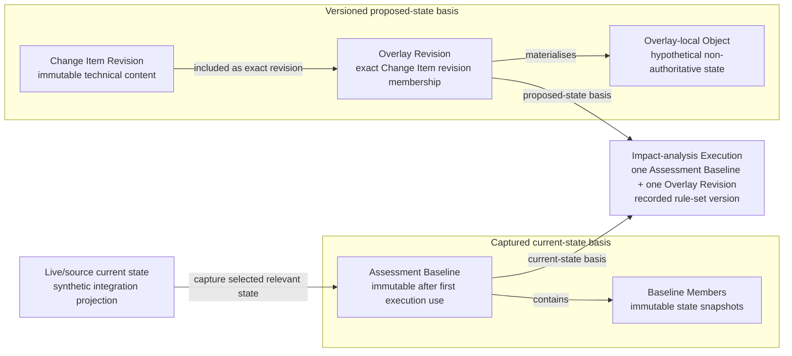

# Canonical Diagram 2 — Current State, Assessment Baseline and Proposed-State Separation

**Status:** Editable semantic source for the canonical presentation  
**Purpose:** Make the baseline-plus-overlay construction and its historical-reconstruction consequence visible without treating live source state, captured state and proposed state as equivalent.

## Visual statement

> Impact analysis evaluates an immutable captured current-state basis together with one versioned proposed-state overlay. It does not rewrite the authoritative current state, and later source changes do not redefine the historical execution basis.

## Editable Mermaid source

## Required caption

> **The Impact-analysis Execution is bound to one Assessment Baseline and one Overlay Revision. It evaluates Baseline Member snapshots as current state and Overlay-local Objects as proposed state; it does not read later live source values as historical meaning.**

## Concept boundaries

| Concept | Meaning in the diagram | Must remain distinct from |
|---|---|---|
| **Live/source current state** | Current records in the synthetic integration projection from which selected relevant state can be captured. | Assessment Baseline; historical execution meaning. |
| **Assessment Baseline** | Immutable definition of the captured current-state basis for one Change Case. | Live pointers; Overlay Revision. |
| **Baseline Member** | Immutable snapshot of one baseline-relevant object and the state required for analysis. | The later mutable source record. |
| **Change Item Revision** | Immutable technical-content revision describing one intended modification. | Change Item Proposal State; terminal Decision disposition. |
| **Overlay Revision** | Immutable exact membership of selected Change Item revisions for one proposed-state evaluation cycle. | Assessment Baseline; authoritative product state. |
| **Overlay-local Object** | Hypothetical proposed Product Version or Product Structure Occurrence state materialised inside one Overlay Revision. | Authoritative enterprise identity or released product state. |
| **Impact-analysis Execution** | Identifiable execution bound to one case-local baseline, one overlay and a recorded rule-set version. | A generic business capability or autonomous decision-maker. |

## Arrow semantics

| Arrow | Meaning |
|---|---|
| Live/source current state → Assessment Baseline | Selected relevant current-state content is captured for a bounded analysis. This is not a claim that the complete enterprise state is copied. |
| Assessment Baseline → Baseline Members | The baseline consists of immutable captured member states rather than live pointers. |
| Change Item Revision → Overlay Revision | The overlay contains the exact selected Change Item revision set used for that proposal cycle. |
| Overlay Revision → Overlay-local Object | Applying the exact revision set materialises hypothetical proposed-state representations without mutating the baseline. |
| Assessment Baseline → Impact-analysis Execution | The execution references and evaluates the captured current-state basis. |
| Overlay Revision → Impact-analysis Execution | The execution references and evaluates the exact proposed-state overlay. |

## Required semantic callouts

- **Gate A precedes Assessment Baseline creation** and therefore does not read Baseline Members.
- **Overlay Execution Eligibility follows baseline selection** and verifies baseline-relative target integrity before impact execution.
- A proposal revision requires a **new Overlay Revision and Impact-analysis Execution**, but does not automatically require a new Assessment Baseline.
- A Product Version captured as a Product Version Baseline Member becomes immutable within the demonstrator.
- Historical reconstruction uses Baseline Member snapshots, Overlay-local Objects, locked Assessments and immutable Evidence snapshots—not later mutable source values.

## Scenario anchors

- **Scenario A:** `BL-A01 + OV-A01 → IAX-A01`.
- **Scenario B first cycle:** `BL-B01 + OV-B01 → IAX-B01`.
- **Scenario B second cycle:** the authoritative current-state basis remains valid, so `BL-B01` is reused while `OV-B02` and `IAX-B02` are new.
- **Scenario C:** `BL-C01 + OV-C01 → IAX-C01`.

## Source anchors

- [Business Architecture — Assessment Baseline, Proposed-State Overlay and baseline reuse](../../01-business-architecture/Business_Architecture_Definition_v0.3.1_Frozen_Implementation_Baseline.md)
- [Logical Information Model — governing invariants, Baseline Member, Overlay Revision and Impact-analysis Execution](../../02-logical-information-model/Product_Change_Impact_Decision_Readiness_Logical_Information_Model_v0.3.2_Frozen_Implementation_Baseline.md)
- [Scenario Data Definition — exact A–C baseline, overlay and execution records](../../03-scenario-data/Product_Change_Impact_Decision_Readiness_Scenario_Data_Definition_v0.1.md)
- [Solution Architecture — baseline, overlay, immutability and historical reconstruction](../../05-solution-architecture/Product_Change_Impact_Decision_Readiness_Solution_Architecture_v0.1_Frozen_Implementation_Baseline.md)

## Do not imply

- that an Assessment Baseline is a live pointer set;
- that an Overlay Revision becomes authoritative product state;
- that Impact Candidate discovery changes Proposed Change Scope or Decision Scope;
- that a proposal change automatically creates a new Assessment Baseline;
- that the execution may mix records from different Change Cases;
- that the synthetic integration projection is an enterprise system of record.
