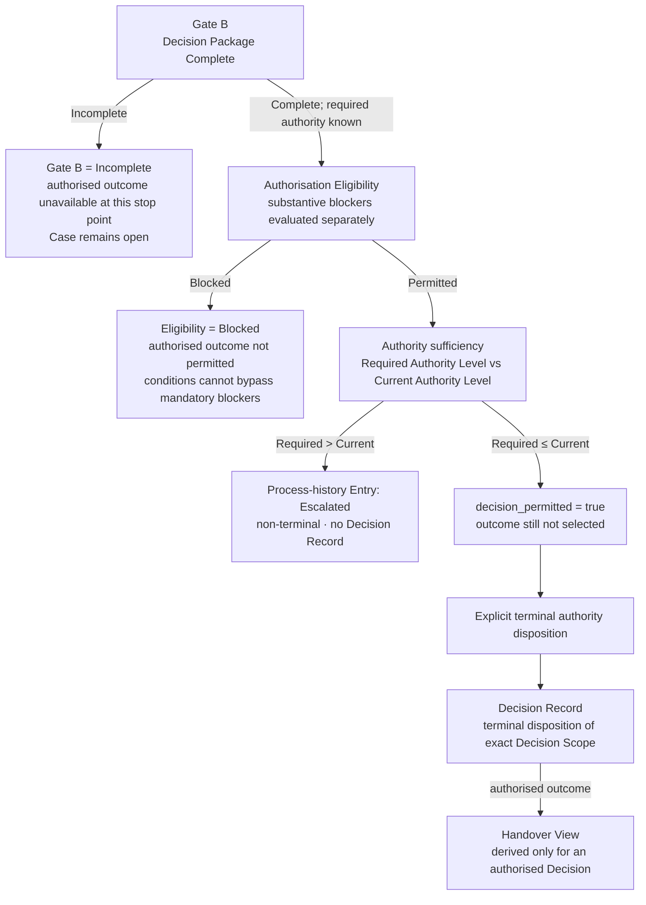

# Canonical Diagram 3 — Gate B, Authorisation Eligibility, Authority and Decision

**Status:** Editable semantic source for the canonical presentation  
**Purpose:** Show that package completeness, substantive eligibility, authority sufficiency, explicit authority action and terminal Decision persistence are separate questions.

## Visual statement

> A complete Decision Package is not automatically eligible for authorisation, sufficient authority does not choose an outcome, and insufficient authority creates a non-terminal escalation rather than a Decision Record.

## Editable Mermaid source



## Required caption

> **Gate B answers whether the package is complete. Authorisation Eligibility answers whether an authorised outcome is substantively permitted. Authority sufficiency answers whether the current authority may act. Only an explicit terminal authority disposition creates a Decision Record.**

## Scope note

This canonical diagram shows the authorised-decision path exercised by **Scenario A** and the non-terminal authority-escalation path exercised by **Scenario C**. `Rejected` remains a frozen terminal Decision outcome with separate persistence preconditions, but it is not exercised by Scenarios A–C and is not expanded in this diagram.

Scenario B’s `Scope Revision Required` route occurs before terminal-readiness progression and is presented on the scenario slide, not added to this canonical diagram.

## Question separation

| Step | Exact question | Result does not mean |
|---|---|---|
| **Gate B** | Is the Decision Package complete, including execution, routing, exact scope, mandatory obligations, candidate coverage, blocking Open Items, Evidence criteria and known required authority? | That authorisation is substantively permitted. |
| **Authorisation Eligibility** | Do mandatory Assessment dispositions or Requirement Conclusions block an authorised outcome? | That the current authority level is sufficient. |
| **Authority sufficiency** | Is `required_authority_level <= current_authority_level`? | That the engineering outcome has been selected. |
| **Explicit authority disposition** | Which permitted terminal outcome is explicitly recorded by the authority? | An automated rule result. |
| **Decision Record** | What exact Change Item revisions are terminally disposed on the recorded baseline, overlay, execution and supporting Assessment basis? | Disposition of the abstract Change Case as a whole. |

## Branch semantics

### Gate B = Incomplete

- No authorised outcome is available at that stop point.
- The case remains open.
- Scenario B second cycle stops in `In Assessment` because `AO-B21` and `AO-B22` remain unsatisfied.
- Authorisation Eligibility and authority sufficiency are not evaluated at that frozen stop point.

### Eligibility = Blocked

- An authorised outcome is not permitted when a mandatory Assessment has `Objection` or `Escalation Recommended`, or a mandatory Requirement Conclusion is `Not Satisfied` or `Not Demonstrated`.
- `Authorised with Conditions` cannot override those blockers.
- The baseline does not implement an Elevated-authority override of substantive blockers.

### Required Authority Level > Current Authority Level

- Persist an `Escalated` Process-history Entry.
- Create no Decision Record.
- Keep the case open.
- Scenario C remains `Decision Ready` because its package stays complete while authority is insufficient.

### Required Authority Level ≤ Current Authority Level

- `decision_permitted = true` only when Gate B is Complete and Authorisation Eligibility is Permitted.
- No Decision Record exists until an explicit authority disposition command is supplied.
- Scenario A records `DEC-A01` only after the explicit `Authorised for Downstream Processing` action.

### Decision Record

- Disposes an exact non-empty Decision Scope of Change Item revisions.
- References the exact Assessment Baseline, Overlay Revision, Impact-analysis Execution and supporting Assessments.
- A Handover View is derived only for an authorised Decision; it is not persisted as another business object.

## Scenario anchors

### Scenario A

```text
Gate B = Complete
→ Authorisation Eligibility = Permitted
→ Standard ≤ Standard
→ decision_permitted = true
→ explicit authority disposition
→ DEC-A01
→ Closed by Decision
→ Handover View
```

### Scenario C

```text
Gate B = Complete
→ Authorisation Eligibility = Permitted
→ Elevated > Standard
→ HIST-C01 = Escalated
→ no Decision Record
→ Case remains Decision Ready
```

## Source anchors

- [Business Architecture — process boundary, authority, Decision and Scenario C](../../01-business-architecture/Business_Architecture_Definition_v0.3.1_Frozen_Implementation_Baseline.md)
- [Logical Information Model — Gate B, Authorisation Eligibility, Authority Level and Decision constraints](../../02-logical-information-model/Product_Change_Impact_Decision_Readiness_Logical_Information_Model_v0.3.2_Frozen_Implementation_Baseline.md)
- [Readiness and Routing Rules — normative order, Gate B, eligibility, authority and explicit Decision persistence](../../04-readiness-routing-rules/Product_Change_Impact_Decision_Readiness_Readiness_and_Routing_Rules_v0.1_Frozen_Implementation_Baseline.md)
- [Scenario Data Definition — exact Scenario A, B and C stop-point values](../../03-scenario-data/Product_Change_Impact_Decision_Readiness_Scenario_Data_Definition_v0.1.md)

## Do not imply

- that Gate B is an approval decision;
- that a complete package is automatically eligible for authorisation;
- that sufficient authority selects the terminal outcome;
- that escalation creates or partially creates a Decision Record;
- that `No Objection with Conditions` automatically creates a Decision Condition;
- that a Decision Record disposes the Change Case rather than an exact Decision Scope;
- that the baseline implements enterprise approval hierarchy or automated engineering approval.
